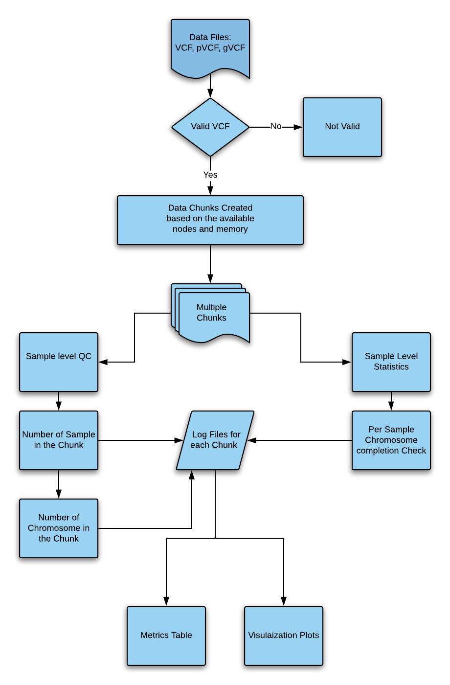
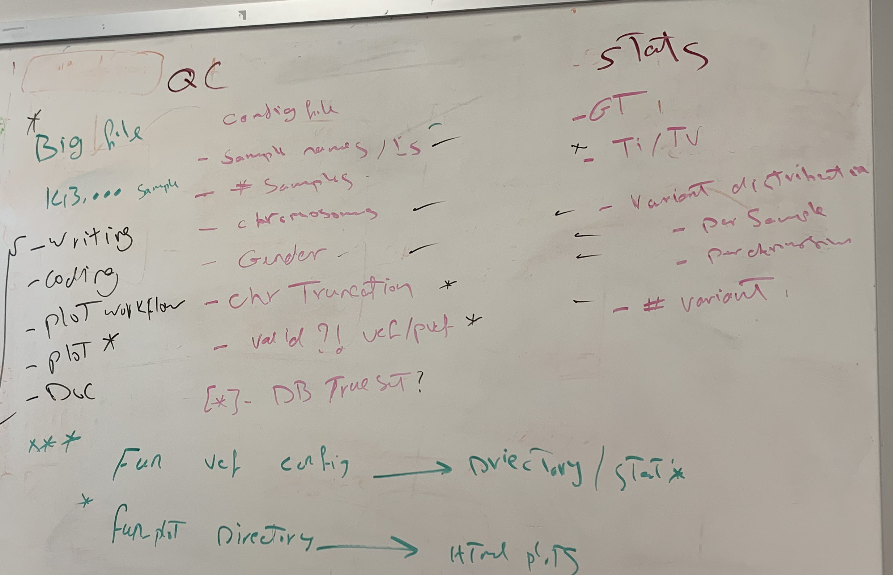
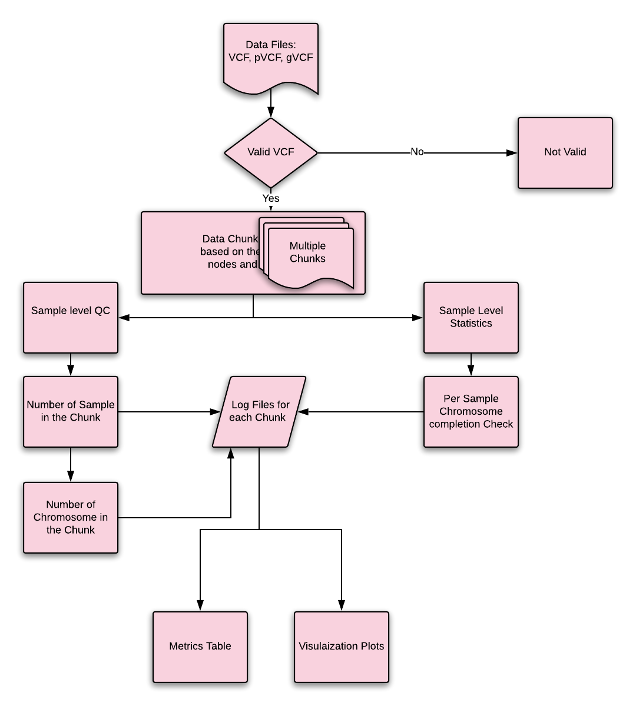
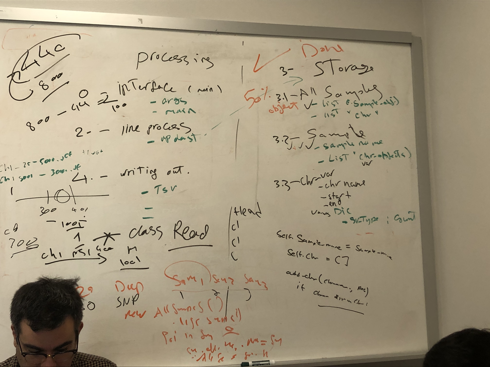

# Clouseau
**A QC suite for large VCF files**

## Workflow



## Usage
``` 
clouseau.py -derp
```

## Output
The output of Clouseau is are a set of files. One file named “sample.tsv.”
```
CHROM	SV1	SV2	SVn	start	end
ChrN  0 1 1 100
ChrN+1 1  1 1 78  
```

Log file for gaps, named "gaps.tsv."
```
Sample_name	gap_start gap_end
Sample 1 	800	1000
```

## Early Planning 





## Proposed implementation plan

The code is separated into two modules: Storage and Processing. This allows for easy swap out of Processing module with low level language for faster processing if needed. 



## Acknowledgements & Thanks
The first version of Clouseau was completed during the NCBI-BCM Codeathon from October 11-13, 2019 at Baylor College of Medicine in Houston, Texas.

## Authors
Medhat Mahmoud (Project Lead) @
Baylor College of Medicine, Human Genome Sequencing Center
One Baylor Plaza, Houston, TX 77030

Venkat Sai Malladi @
Department of Bioinformatics, University of Texas Southwestern Medical Center, 
5323 Harry Hines Blvd, Dallas, TX 75390

Alejandro Rafael Gener @
Margaret M. and Albert B. Alkek Department of Medicine, Nephrology, Baylor College of Medicine, Houston, Texas, USA;
Baylor College of Medicine, Integrative Molecular and Biomedical Sciences Program,Houston, Texas, USA;
MD Anderson Cancer Center, Department of Genetics, Houston, Texas, USA;
Universidad Central del Caribe, School of Medicine, Bayamón, Puerto Rico, USA.

Robert Fullem @
Molecular and Human Genetics Department, Baylor College of Medicine
One Baylor Plaza, Houston, TX 77030

Arkarachai Fungtammasan @
DNAnexus
1975 W.El Camino Real, Mountain view, CA 94040

Vipin K Menon @
Human Genome Sequencing Center,
Baylor College of Medicine, Houston 77054

